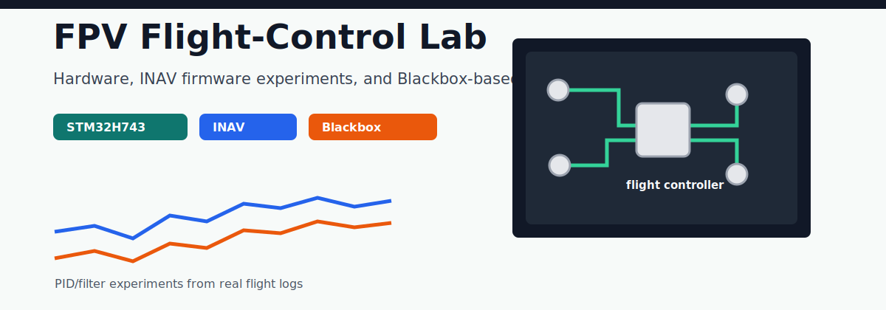

# FPV flight-control hardware, INAV firmware, and tuning tools

I build and document FPV drone flight-control projects across hardware,
firmware, and Blackbox-log analysis.

## Current Review Requests

If you work with INAV, FPV hardware, ESCs, or Blackbox logs, specific feedback is welcome:

| Area | What I need | Link |
|---|---|---|
| SkyPilot H743 | PCB layout, ICM42688P DRDY wiring, vibration and grounding review | [Review issue](https://github.com/19379353560/skypilot/issues/1) |
| 75A 4-in-1 ESC | High-current routing, MOSFET/gate-driver placement, thermal assumptions | [Review issue](https://github.com/19379353560/DIY_Flight_Controller_and_4in1_ESC/issues/1) |
| INAV PID Tuner | Anonymized Blackbox logs and tuning-rule feedback | [Share logs](https://github.com/19379353560/inav-pid-tuner/issues/1) |
| INAV D-term LPF | Flight-test logs on noisy frames and filter-profile behavior | [Flight-test issue](https://github.com/19379353560/inav/issues/1) |

## Featured Projects

| Project | What it is | Status |
|---|---|---|
| [SkyPilot H743](https://github.com/19379353560/skypilot) | Open-source STM32H743 flight controller hardware for INAV, with ICM42688P IMU and firmware files. | Hardware files published; review wanted |
| [DIY Flight Controller and 4-in-1 ESC](https://github.com/19379353560/DIY_Flight_Controller_and_4in1_ESC) | 10-layer 75A 4-in-1 ESC hardware project with Gerbers, schematic, and PCB previews. | Manufacturing files published; thermal/current review wanted |
| [INAV PID Tuner](https://github.com/19379353560/inav-pid-tuner) | FastAPI tool for analyzing INAV Blackbox logs and generating PID/filter tuning recommendations. | Prototype available; validation logs wanted |
| [INAV Firmware Experiments](https://github.com/19379353560/inav) | Personal INAV branch focused on D-term pre-differentiation filtering, scheduler cleanup, and SkyPilot target support. | Upstream PRs opened; flight-test feedback wanted |

## Current Focus

- Reducing D-term noise amplification in INAV with pre-differentiation filtering.
- Improving IMU sampling latency for custom STM32H743 flight-controller hardware.
- Turning Blackbox logs into practical PID and filter tuning suggestions.
- Publishing PCB files and firmware notes so other FPV builders can inspect and reproduce the work.

## Upstream Work

- [iNavFlight/inav#11464](https://github.com/iNavFlight/inav/pull/11464) - D-term pre-differentiation LPF.
- [iNavFlight/inav#11465](https://github.com/iNavFlight/inav/pull/11465) - D-term pre-diff LPF plus code quality improvements.

## Feedback Welcome

I am especially interested in feedback from INAV and FPV builders on:

- D-term filtering behavior on noisy frames.
- STM32H743 flight-controller target design.
- Blackbox-based PID and filter tuning workflows.
- PCB layout review for high-current ESC and IMU signal integrity.

The fastest way to help is to comment on one of the review-request issues above with logs, screenshots, board notes, or comparable design references.

## Useful Links

- [Portfolio site](https://19379353560.github.io/)
- [SkyPilot H743 flight controller](https://github.com/19379353560/skypilot)
- [75A 4-in-1 ESC hardware](https://github.com/19379353560/DIY_Flight_Controller_and_4in1_ESC)
- [INAV PID Tuner](https://github.com/19379353560/inav-pid-tuner)
- [INAV firmware branch](https://github.com/19379353560/inav)
